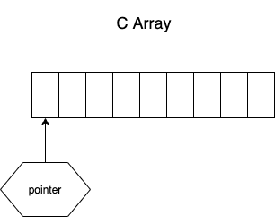
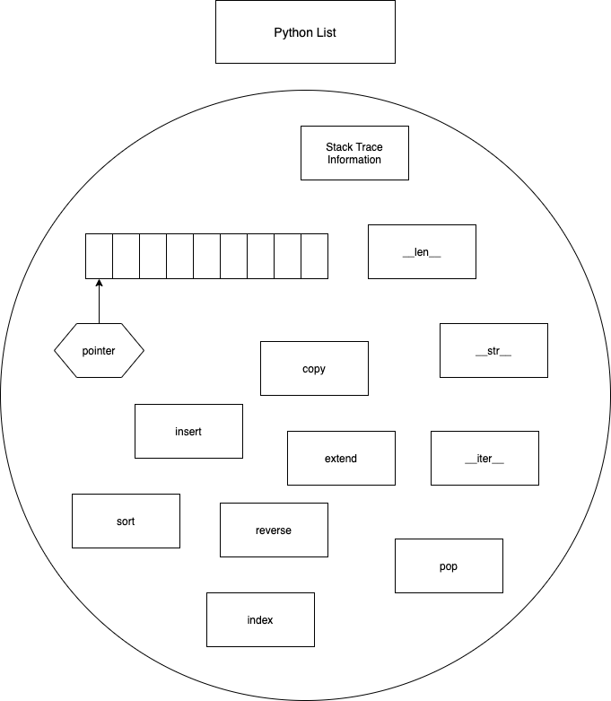
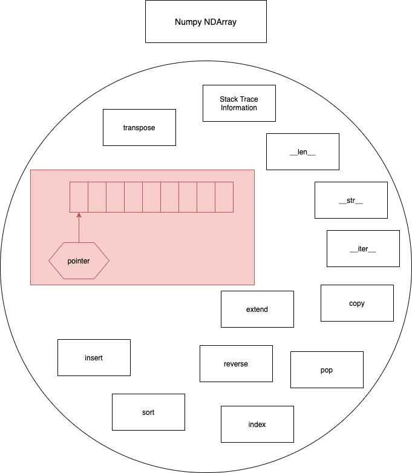
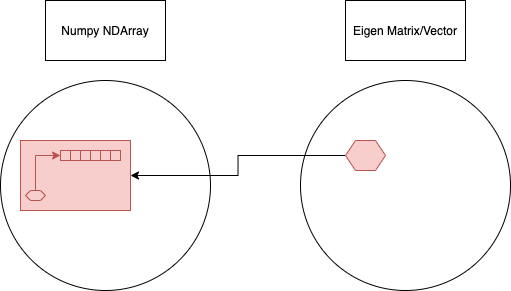

Python@PNNL
---
Short demo for interfacing Python data types and C/C++, specifically array- and matrix-like objects.

Getting Started
---

You will need:
- Python 3
- Cmake >= 3.12
- A C compiler suite
- Git

First clone the repo and pull initialize submodules:
```bash
git clone https://github.com/ashermancinelli/python-pnnl-demo.git
cd python-pnnl-demo
git submodule init
git submodule update
```

Than select the C compiler you'll use (here I use GCC 9):
```bash
export CC=gcc-9 CXX=g++-9

# Or for clang:
export CC=clang CXX=clang++
```

Ensure CMake version is greater than 3.12:
```bash
> cmake --version
cmake version 3.17.2

CMake suite maintained and supported by Kitware (kitware.com/cmake).
```

Build with CMake:
```bash
mkdir buld
cd build
cmake ..
make
```

Basic Case
---

Pybind11 is very similar to Boost.Python, however *much* lighter and easier to work with.
This generates bindings between python and C++ using modern C++ conventions like constant expressions.

Pybind11 gives you automatix casts to pretty much the entire standard template library.
From there, anything in C++-land is available to you, like threading, message passing, etc.
You can also call C and Fortran routines from here, or utilize other pyhton libraries with C/C++ interfaces such as PyTorch and Tensorflow.

***Example 1***

Advanced Cases
---
1. Eigen
    - Automatic conversion from `numpy` arrays
    - Shared data
    - built-in parallelism
    
C Array
---




Python List
---




Numpy NDArray
---



Numpy to Eigen Conversion
---




From the [ pybind11 docs ](https://pybind11.readthedocs.io/en/stable/advanced/cast/eigen.html):
> When returning an ordinary dense Eigen matrix type to numpy (e.g. `Eigen::MatrixXd` or `Eigen::RowVectorXf`) pybind11 keeps the matrix and returns a numpy array that directly references the Eigen matrix: no copy of the data is performed.
 The numpy array will have `array.flags.owndata` set to False to indicate that it does not own the data, and the lifetime of the stored Eigen matrix will be tied to the returned array.

***Example 2***
